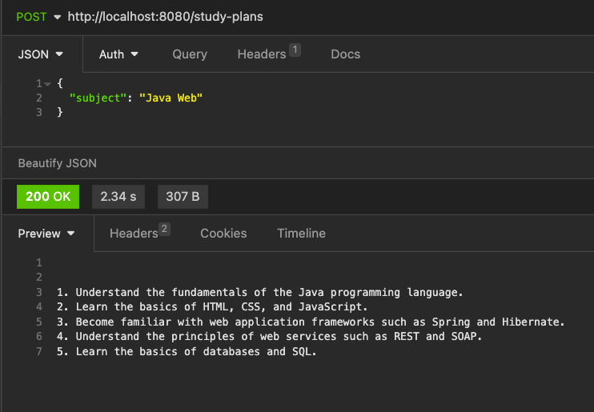
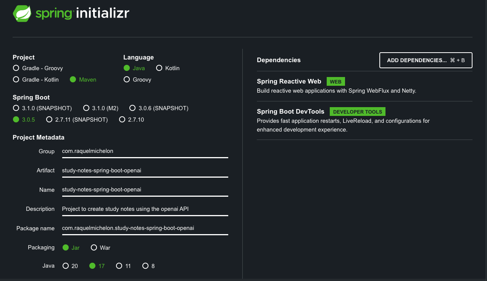

<h1 align="center"> Study Plan Generator with OpenAI API </h1>

<p align="center">
API for study plan generation given certain subject using OpenAI API <br/>
</p>

<p align="center">
  <a href="#-setup">Setup</a>&nbsp;&nbsp;&nbsp;|&nbsp;&nbsp;&nbsp;
  <a href="#-technologies">Technologies</a>&nbsp;&nbsp;&nbsp;|&nbsp;&nbsp;&nbsp;
  <a href="#-project">Project</a>&nbsp;&nbsp;&nbsp;|&nbsp;&nbsp;&nbsp;
  <a href="#-acknowledgment">Acknowledgment</a>&nbsp;&nbsp;&nbsp;|&nbsp;&nbsp;&nbsp;
  <a href="#memo-licença">License</a>
</p>

<p align="center">
  
</p>

<br>

> Note! This project is a working in progress

<br>

## 🚧 Setup

### To have this project running locally:

1 - Clone the project using `git clone`

2 - Create an account on the OpenAi platform

3 - Copy the OpenAi API key to the `application.properties` file

4 - On the Controller, check the Client URL on the @CrossOrigin annotation

5 - Run the application

6 - Test the application via curl (or an HTTP client of your choice) - I developed an UI project you can use for this API that can be found [here](https://github.com/RaquelMichelon/study-plan-vuejs-ui)

```
curl http://localhost:8080/study-plans -H "Content-Type: application/json" -d "Geometry"

```



## 🚀 Technologies

- [OpenAI API for Study Notes creation](https://platform.openai.com/examples/default-study-notes)
- Java
- Maven
- Spring WebFlux

This project was started via Spring initializer with the following configurations:



## 💻 Project

This is an API that lists the 5 most important content to be studyed given a subject.

> Note! For the sake of simplicity and because it is beyond this mini-project scope, all classes were written in the same file, which is not recommended for real projects.

## ♡ Acknowledgment

This project was possible thanks to [Giuliana Bezerra](https://github.com/giuliana-bezerra) who originally created and prepared the following [tutorial](https://www.youtube.com/watch?v=fC_OdD6zy-Y).

## :memo: Licença

This project has the MIT license.

---

⌨️ Developed by [Raquel Michelon](https://github.com/RaquelMichelon)
